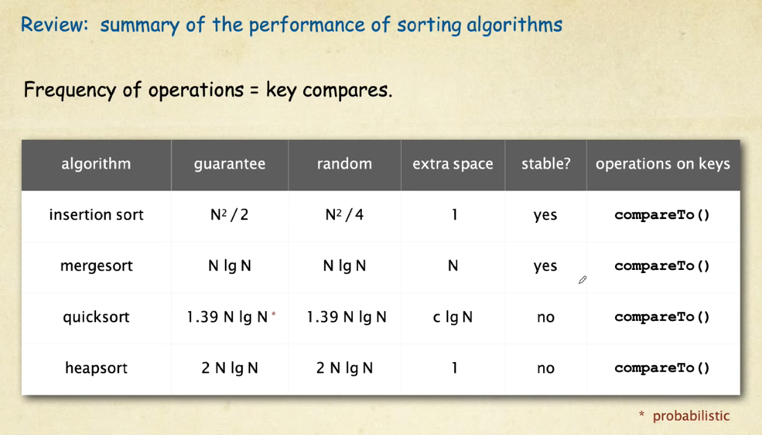
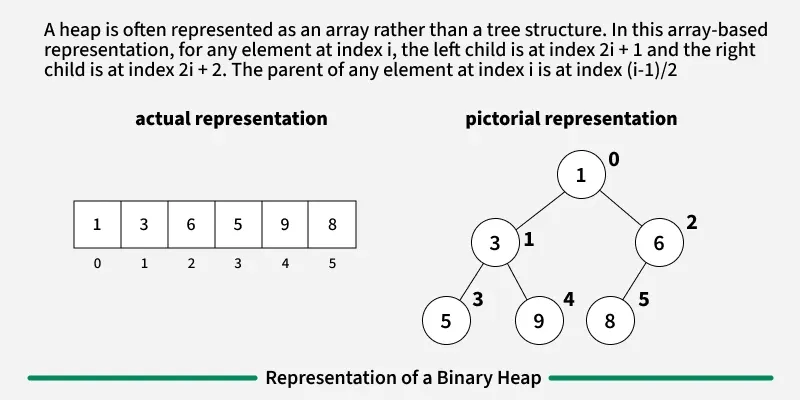

# Resources

[Java Cheat Sheet](Files/Java-Cheat-Sheet.pdf)


# Java Basics

- The stack is memory allocation for local variables and method calls
- The heap is memory allocation for objects and instance variables
- Instantiaion - Allocating memory to create an object
- Initialization - Assignment of values when object is instantiated
- 'This' is only required when there is a namespace collision	
- 'Static' indicates class membership which differs from instance membership

	
- A constant is a variable whose value cannot be changed once its assigned
  - Uses 'final' 
    - Final is a non-access modifier

# Access Control
- public - accessible everywhere
- protected - accessible in the same package and in sub-class
- default - accessible only in the same package	
- private - accessible only in the same class

# Object Oriented Programming
## Inheritance
- inheriting the common state and behavior
- The subclass (child) extends the super class (parent)
- A subclass cannot extend multiple super classes
- Variables are determined from the reference type	
- Methods are determined from the actual type

## Polymorphism
- Method overloading is an example of compile-time polymorphism	
  - Method overloading is when you have multiple methods with the same name but different parameters
  - A class cannot have multiple methods with the same signature and different primitive return types	
    - A signature is the method name and its parameters
- Method overriding is an example of run-time polymorphism 
  - Method overriding is redefining a super class method
  - Return types must remain consistent
- run-time polymorphism doesn't happen for static methods 
  - i.e. a static method will refer to the reference type and not the actual type
- Final Keyword
  - prevent the inheritance process 
  - preserve the consistent state of the object
  - Final Class: immutable class and prevent inheritance  
  - Final Method: prevent overriding 
  - Final Variable: Constant variable
  - Private methods are final and cannot be overridden 

## Abstraction
- Abstract classes are incomplete 
- Abstract methods have declarations but no implementations  
- If a class has a single abstract method, the class must be abstract 
- Objects cannot be created from abstract classes 
- You cannot reduce the visibility of an inherited method

### Interfaces
- Contains method signatures to define specifications 
- Subtypes must follow the specifications 
- Declares What to implement but not how to implement 
- An interface can extend multiple interfaces 
- Interfaces can have implementations for default methods 
  - This was added so that adding methods to an interface wouldn't break all implementing classes

## Encapsulation	
- Wrapping code and data together into a single unit	
- Private members and access only through public getters and setters	
- Whatever changes, encapsulate it	
- Encapsulation is about "How" a class does things

# SOLID Principles
## Single Responsibility Principle
[Geeks for Geeks](https://www.geeksforgeeks.org/system-design/single-responsibility-in-solid-design-principle/)
- A class should do one thing therefore it should have only a single reason to change
- Makes code easier to test
- Less dependencies to other modules / classes
- Better code organization and less complexity
- Example: Using multiple classes, each one providing a small bit of logic, versus one large class which does everything

## Open-Closed Principle
[Geeks for Geeks](https://www.geeksforgeeks.org/java/open-closed-principle-in-java-with-examples/)
- Software components should be open for extension but closed for modification
- Typically done through the use of interfaces and abstract classes
- Example: Adding functionality to a geometric object area calculator

## Liskov Substitution Principle
[Geeks for Geeks](https://www.geeksforgeeks.org/system-design/solid-principle-in-programming-understand-with-real-life-examples/#)
- Derived types must be completely substitutable for their base types
- Implementations of the same interface should never give a different result
- Example: Square and rectangle
- Example: https://www.youtube.com/watch?v=qO9Iy1eip5U

## Interface Segregation Principle
[ndepend](https://blog.ndepend.com/solid-design-the-interface-segregation-principle-isp/)

[Geeks for Geeks](https://www.geeksforgeeks.org/system-design/solid-principle-in-programming-understand-with-real-life-examples/)
- Clients should not be forced to implement unnecessary methods which they will not use
- Example: Only needing to read from a list - write operations not needed

## Dependency Inversion Principle
[Geeks for Geeks](https://www.geeksforgeeks.org/system-design/dependecy-inversion-principle-solid/)
[stackify](https://stackify.com/dependency-inversion-principle/)
- High level modules, which provide complex logic, should be easily reusable and unaffected by changes in low-level modules, which provide utility features. This requires an abstraction that decouples
the high level and low level modules from each other.
Or
- High level modules should not depend on low level modules. Both should depend on abstractions. Abstractions should not depend on details. Details should depend on abstractions.
- Example: https://www.youtube.com/watch?v=9oHY5TllWaU&t=1s

# Data Structures

## Arrays and Strings
- A memory allocation for a group of values
- Arrays can be static or dynamic in size
- Arrays can be single or multidimensional
### Time Complexity
- O(n)

## Unordered list
### Time complexity
- Most operations perform at O(n)

## Linked Lists
- A series of objects called nodes, chained together in a single direction
### Use Cases
- Constant time insertion and deletion
- Insert items into the middle
- No need for random access to elements
### Time Complexity
- Insertion and deletion at beginning O(1)
- Insertion and deletion at end O(n)
- Insertion and deletion at position O(n)
- Search O(n)

## Doubly Linked Lists
- A linked list which contains references to previous and next nodes allowing for bidirectional traversal
### Time Complexity
- Insertion and deletion at beginning O(1)
- Insertion and deletion at end O(1)
- Insertion and deletion at position O(n)
- Search O(n)

## Hash Map
- Key value pair where a hash is applied to the key to create an index. The value is then stored at that index.
- Hash collisions can be improved by increasing the size of the table
### Time Complexity
- Typically O(1)
  - Can be lower if there are hash collisions

## Stacks
- Last in First out
- Add an item to the top, peek from the top, pop from the top
- Sets a natural priority
### Time Complexity
- All operations O(1)

## Queue
- First in first out
- Waiting in a line

## Priority Queue
https://www.geeksforgeeks.org/dsa/priority-queue-set-1-introduction/
- A queue which arranges elements based on their priority values
- Each element has a priority, when we add it its inserted into a position which reflects its priority
- Elements with higher priority are retrieved before elements with lower priorities
- An example would be a binary heap

Operations
- Insert
- Delete
- Peek

### Linked List Priority Queue
#### Time complexity
- push O(n)
- pop O(1)
- peek O(1)

### Binary Heap
https://www.geeksforgeeks.org/dsa/binary-heap/
- A complete binary tree that stores data efficiently based on a max or min value
- Heap sort uses a binary heap to sort an array in O(n log n) time
- Nodes are placed in order such that each level of the tree is filled out, then heapify guarantees ordering based on value
#### Time Complexity
- peek O(1)
- insert O(log n)
- delete O(log n)

## Trees
- The best of linked lists

### Binary Tree
- A tree whose elements have at most 2 children

### Binary Search Tree
- A type of binary tree data structure in which each node contains a unique key and satisfies a specific ordering property
- For all nodes, all values in the left subtree are smaller and values in the right subtree are larger
- self balancing BSTs (AVL and Red Black Tree) guarantee Log n operations
- Used in database indexing, symbol tables, range queries
#### Hibbard Deletion
- Find the left most key in the right child,
- replace key to be deleted with child
#### Time Complexity
*If the tree is balanced*
- search O(h)
- insert O(h)
- delete O(h)
    * Where h is the height of the tree
    * O(h) works out to by O(log n)
*Worst case (unbalanced)*
- search O(n)
- insert O(n)
- delete O(n)

### Red Black Trees
https://www.geeksforgeeks.org/dsa/introduction-to-red-black-tree/
- A type of Binary Search Tree
- Self balancing
- Each node is associated with a color, either red or black
  - Root nodes are always black
  - Red nodes cannot have red children
  - Every path from a node to its descendant null nodes (leaves) has the same number of black nodes
#### Time Complexity
- Search, insert and delete are all O(log n)

### 2-3 Trees
- Height balanced tree
- Nodes can either have 2 or 3 children
  - Nodes with 2 children have one data value, nodes with 3 children have 2 data values
- Tree is always balanced, leafs are at the same level
- The left child is always less than the two values stored, the middle child is between the two values and the right child is greater
#### Operations
https://www.youtube.com/watch?v=QO90Dq_B9xs
https://www.youtube.com/watch?v=b0naM_7ofYo
- Adding a node 
  - The value is always added to an existing leaf node
    - If the existing node now has three values, the middle value is bubbled up to be the parent (it will join an existing parent if the existing parent only holds a single value)
- Deleting a node - it gets replaced by its in-order successor
#### Time Complexity
- insert, search and delete all take O(log n)

# Sorting Algorithms



## Insertion Sort
https://www.geeksforgeeks.org/dsa/insertion-sort-algorithm/
- Insertion sort is a simple sorting algorithm that works by iteratively inserting each element of an unsorted list into its correct position in a sorted portion of the list.

```java
public class InsertionSort {
    /* Function to sort array using insertion sort */
    void sort(int arr[]) {
        int n = arr.length;
        for (int i = 1; i < n; ++i) {
            int key = arr[i];
            int j = i - 1;

            /* Move elements of arr[0..i-1], that are
               greater than key, to one position ahead
               of their current position */
            while (j >= 0 && arr[j] > key) {
                arr[j + 1] = arr[j];
                j = j - 1;
            }
            arr[j + 1] = key;
        }
    }
}
```

### Time Complexity
- Base case - O(n) if the list is already sorted
- Average case: O(n^2)
- Worse case: O(n^2)

### Advantages
- Simple and easy to implement
- Stable
- Space-efficient
- Good for smaller or nearly sorted lists

### Disadvantages
- Inefficient for large lists
- Not as efficient as other algorithms


## Merge Sort
https://www.geeksforgeeks.org/dsa/merge-sort/

Merge sort works by recursively dividing the array into halves and merging them back together to obtain the sorted array
```java
import java.io.*;

class GfG {

    // Merges two subarrays of arr[].
    // First subarray is arr[l..m]
    // Second subarray is arr[m+1..r]
    static void merge(int arr[], int l, int m, int r){
        
        // Find sizes of two subarrays to be merged
        int n1 = m - l + 1;
        int n2 = r - m;

        // Create temp arrays
        int L[] = new int[n1];
        int R[] = new int[n2];

        // Copy data to temp arrays
        for (int i = 0; i < n1; ++i)
            L[i] = arr[l + i];
        for (int j = 0; j < n2; ++j)
            R[j] = arr[m + 1 + j];

        // Merge the temp arrays

        // Initial indices of first and second subarrays
        int i = 0, j = 0;

        // Initial index of merged subarray array
        int k = l;
        while (i < n1 && j < n2) {
            if (L[i] <= R[j]) {
                arr[k] = L[i];
                i++;
            }
            else {
                arr[k] = R[j];
                j++;
            }
            k++;
        }

        // Copy remaining elements of L[] if any
        while (i < n1) {
            arr[k] = L[i];
            i++;
            k++;
        }

        // Copy remaining elements of R[] if any
        while (j < n2) {
            arr[k] = R[j];
            j++;
            k++;
        }
    }

    // Main function that sorts arr[l..r] using
    // merge()
    static void mergeSort(int arr[], int l, int r){
        
        if (l < r) {

            // Find the middle point
            int m = l + (r - l) / 2;

            // Sort first and second halves
            mergeSort(arr, l, m);
            mergeSort(arr, m + 1, r);

            // Merge the sorted halves
            merge(arr, l, m, r);
        }
    }

    // Driver code
    public static void main(String args[]){
        
        int arr[] = {38, 27, 43, 10};
        
        mergeSort(arr, 0, arr.length - 1);
        
        int n = arr.length;
        for (int i = 0; i < n; ++i)
            System.out.print(arr[i] + " ");
        System.out.println();
    }
}
```
### Time Complexity
Merge Sort will always operate with efficiency of O(n log n)

### Advantages
 - Stability - maintains the relative order of equal elements in the input array
 - Guarenteed worst-case performance of O(n log N)
 - Simple to implement due to divide and conquer

### Disadvantages
- Space complexity - requires additional memory to store the merged sub-arrays during the sorting process
- Generally slower than quick sort 

## Quick Sort
https://www.geeksforgeeks.org/dsa/quick-sort-algorithm/
https://www.youtube.com/watch?v=Vtckgz38QHs

Quick sort is a sorting algorithm based on the Divide and Conquer that picks an element as a pivot and partitions
the given array around the picked pivot by placing the pivot in its correct position in the sorted array.

Assign a value as the 'pivot'
assign j to index 0
assign i to j - 1

While j < pivot
    If j is less than pivot,
    j + 1
    else
    i + 1
    Swap the values of i and j
i + 1
swap values of i and j (pivot is now in the correct place)
Now create two sub-arrays
    From element 0 to pivot - 1
    From element pivot + 1 to last element  
Call quick sort on each sub-array


```java
import java.util.Arrays;

class GfG {

    // partition function
    static int partition(int[] arr, int low, int high) {
        
        // choose the pivot
        int pivot = arr[high];
        
        // index of smaller element and indicates 
        // the right position of pivot found so far
        int i = low - 1;

        // traverse arr[low..high] and move all smaller
        // elements to the left side. Elements from low to 
        // i are smaller after every iteration
        for (int j = low; j <= high - 1; j++) {
            if (arr[j] < pivot) {
                i++;
                swap(arr, i, j);
            }
        }
        
        // Move pivot after smaller elements and
        // return its position
        swap(arr, i + 1, high);  
        return i + 1;
    }

    // swap function
    static void swap(int[] arr, int i, int j) {
        int temp = arr[i];
        arr[i] = arr[j];
        arr[j] = temp;
    }

    // the QuickSort function implementation
    static void quickSort(int[] arr, int low, int high) {
        if (low < high) {
            
            // pi is the partition return index of pivot
            int pi = partition(arr, low, high);

            // recursion calls for smaller elements
            // and greater or equals elements
            quickSort(arr, low, pi - 1);
            quickSort(arr, pi + 1, high);
        }
    }

    public static void main(String[] args) {
        int[] arr = {10, 7, 8, 9, 1, 5};
        int n = arr.length;
      
        quickSort(arr, 0, n - 1);
        
        for (int val : arr) {
            System.out.print(val + " ");  
        }
    }
}
```

### Time Complexity
- Best is Gamma of n log n - O(n log n)
- Average is theta of n log n - O(n log n)
- Worst case is On^2

### Advantages
- Efficient on large data sets
- Requires a small amount of memory
- Fastest general purpose algo for large data when stability not required

### Disadvantages
- Worse-case time complexity of On^2
- Not good for small datasets
- Its not stable meaning if two elements have the same key, their relative order will not be preserved in the sorted output

## Heap Sort
Comparison-based sorting technique based on the [Binary Heap Data Structure](https://www.geeksforgeeks.org/dsa/binary-heap/)



1. Arrange the array as a complete binary tree
2. Build a max heap (binary tree with largest value as the root node, smallest values are leaves)
3. Place the largest value as determined by the max heap to the last index of the array
   - Take the root node and swap it with the lowest value leaf
   - Call heapify so that the new low value leaf node is replaced by the now highest value node
4. Repeat until the array is sorted

```java
import java.util.Arrays;

class GfG {
  
    // To heapify a subtree rooted with node i
    // which is an index in arr[].
    static void heapify(int arr[], int n, int i) {

        // Initialize largest as root
        int largest = i; 

        // left index = 2*i + 1
        int l = 2 * i + 1; 

        // right index = 2*i + 2
        int r = 2 * i + 2;

        // If left child is larger than root
        if (l < n && arr[l] > arr[largest]) {
            largest = l;
        }

        // If right child is larger than largest so far
        if (r < n && arr[r] > arr[largest]) {
            largest = r;
        }

        // If largest is not root
        if (largest != i) {
            int temp = arr[i];
            arr[i] = arr[largest];
            arr[largest] = temp;

            // Recursively heapify the affected sub-tree
            heapify(arr, n, largest);
        }
    }

    // Main function to do heap sort
    static void heapSort(int arr[]) {
        int n = arr.length;

        // Build heap (rearrange array)
        for (int i = n / 2 - 1; i >= 0; i--) {
            heapify(arr, n, i);
        }

        // One by one extract an element from heap
        for (int i = n - 1; i > 0; i--) {

            // Move current root to end
            int temp = arr[0]; 
            arr[0] = arr[i];
            arr[i] = temp;

            // Call max heapify on the reduced heap
            heapify(arr, i, 0);
        }
    }

    // A utility function to print array of size n
    static void printArray(int arr[]) {
        for (int i = 0; i < arr.length; i++) {
            System.out.print(arr[i] + " ");
        }
        System.out.println();
    }

    // Driver's code
    public static void main(String args[]) {
        int arr[] = {9, 4, 3, 8, 10, 2, 5}; 
        heapSort(arr);
        System.out.println("Sorted array is ");
        printArray(arr);
    }
}
```

### Time Complexity
- Always O(n log n)

### Advantages
- Efficient time complexity
- Minimal memory usage
- Simple

### Disadvantages
- Costly
- Unstable
- Inefficient due to the high constants in the time complexity

## Binary Sort
https://www.geeksforgeeks.org/dsa/binary-insertion-sort/
https://www.youtube.com/watch?v=xrMppTpoqdw
Uses binary search for sorting. A binary search algorithm finds the position of a target value within a sorted array. 
Half of the array is eliminated during each "step".

# Search Algorithms
## Binary Search 

### Time Complexity
- Search O(log n)
- Insert O(n)

# Functional Programming
https://www.geeksforgeeks.org/blogs/functional-programming-paradigm/
A programming paradigm in which we try to bind everything in pure mathematics functions. A declarative style of programming which focuses on 
"what to solve" in constrast to an imperative style where the focus is on "how to solve".

## Pure Functions
- Two properties: 
  - 1. They always produce the same output for the same arguments
  - 2. They have no side effects - they do not modify any arguments or local / global variables or input / output streams
```declarative
sum(x, y)           // sum is function taking x and y as arguments
    return x + y
```
## Recursion
- Functional languages do not use for or while loops instead using recursion for iteration
```declarative
fib(n)
    if (n <= 1)
        return 1;
    else
        return fib(n - 1) + fib(n - 2);
```
## Referential Transparency
- Variables are once defined and do not change their value throughout the program.

## Functions are First-Class and can be Higher-Order
- First Class: functions that are treated like variables
  - Can be passed as a parameter, returned from function and stored in data structures
- Higher Order: Functions that take other functions as arguments and can return functions

## Lambda Functions
https://www.geeksforgeeks.org/python/python-lambda-anonymous-functions-filter-map-reduce/
- Lambda functions are anonymous functions which mean they do not have a name.
```python
s1 = 'GeeksforGeeks'
s2 = lambda func: func.upper()
print(s2(s1))
>GEEKSFORGEEKS
```
- map, filter, reduce are all examples of functions which utilize lambda functions

# Expressions Vs Statements
https://www.joshwcomeau.com/javascript/statements-vs-expressions/
- Expressions are pieces of code that produces a value
  - `num > 100` - produces `true` or `false`
- A statement is an instruction for the computer to do something
  - `let hi = 5`